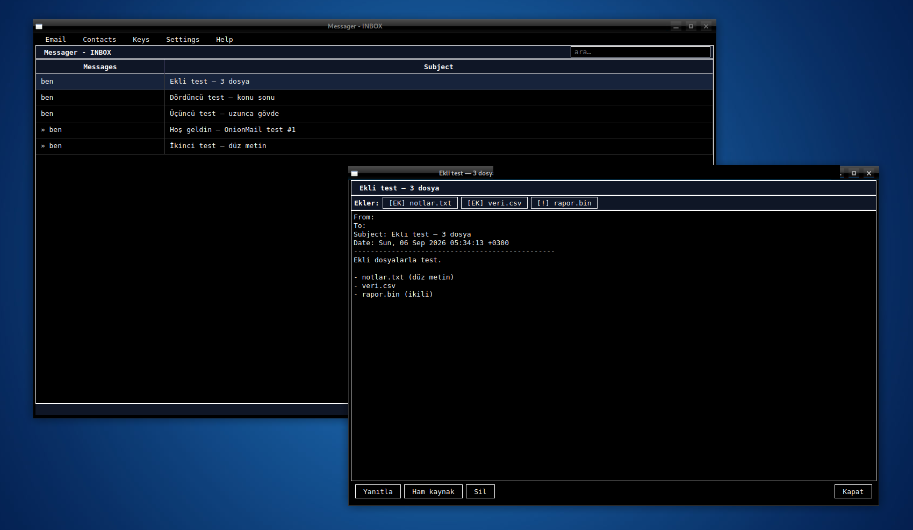

<p align="center">
  
</p>

# onionmail

A personal, **onion-to-onion** SMTP mail system that runs behind a Tor onion
service, with a terminal and a desktop UI. No domains, no DNS, no registrar.
Just as an IRC client reaches a server at its `.onion` over Tor, mail delivery
here works by "connect to the `.onion` in the address on port 25".

> **Closed network:** it only exchanges mail with other onionmail servers (or
> anything that offers an onion MX). It will not send to `gmail.com`. See
> `docs/threat-model.md`.


<p align="center">
  
</p>

## Components

| Module | Job |
|--------|-----|
| `onionmail smtpd`  | Inbound SMTP server. A Tor `HiddenServicePort` forwards here. Writes to a single Maildir **or** a per-account Maildir. |
| `onionmail sender` | Outbound queue worker. Delivers over Tor SOCKS5 to the target `.onion:25`, retries on failure. |
| `onionmail apid`   | **Account + mail API service** (a second onion port). The GUI connects here and authenticates: register (invite code) / login / list / fetch / send / delete. |
| `onionmail gui`    | **Native desktop window** (PySide6) — black-and-white "Messager" (*Who Am I* theme), inverted bars in midnight blue. Menus: `Email · Contacts · Keys · Settings · Help`. Login/Register screen, separate compose window, Collector (sandbox). `--local` reads the Maildir directly on the server. Install: `pip install -e ".[gui]"`. |
| `onionmail tui`    | **Terminal** version of the same UI (Textual, local mode). Handy over SSH on the server. |
| `onionmail invite` / `useradd` / `passwd` | Generate an invite code / add an account / change a password (on the server). |
| `onionmail send` / `status` / `setup-tor` | Send a message / show status / print a `torrc` snippet, from the command line. |

## Two architecture modes

* **Single mailbox** (`accounts.enabled=false`): the GUI/TUI reads the Maildir
  directly; no login. On the server, or over SSH.
* **Multi-user** (`accounts.enabled=true`): `apid` runs and is published on a
  second onion port. The GUI connects from any machine over Tor and logs in with
  a username + password (argon2id, session token, invite-code registration). The
  `Backend` interface lets the same GUI code drive both modes.

## End-to-end encryption

* Opt-in per message (the 🔒 box in the compose window). Uses **age / X25519**
  (`pyrage`); the encrypted message is a single `message.age` MIME part inside a
  minimal envelope, so the server only ever stores ciphertext.
* **TOFU key pinning** (`clientkeys.py`): your own identity is sealed with your
  password; a peer's public key is remembered on first sight and never silently
  replaced — a changed key raises a warning.
* Public keys propagate opportunistically via an `X-Onionmail-Pubkey` header and
  an authenticated directory in `apid` (`pubkey_set` / `pubkey_get`).

## Sandbox

Nothing from an incoming message is opened with a real engine on the host:

* **Safe text view** — `text/plain` is preferred; HTML is neutralised in-process
  (script/style stripped, tags dropped, no remote content loaded).
* **Attachment open** — the attachment is copied to a temp directory and handed
  to the viewer inside `firejail --net=none` (or `bwrap`), with no network
  access. With `sandbox.backend = "none"` it is only extracted to disk.

## Quick start (development)

```bash
python3 -m venv .venv
.venv/bin/pip install -e ".[gui,dev]"
.venv/bin/python -m pytest -q      # 43 tests
```

Real deployment (server / Debian 13): **`docs/tor-setup.md`**.

## Status

- Single mailbox: inbound delivery, queue + retry, Collector/sandbox — working.
- Multi-user: `accounts` + `apid` protocol + `netclient` + `Backend` + GUI
  Login/Settings — working, **43 tests pass** (no Tor, over loopback).
- End-to-end encryption, contact book, message search, per-message 🔒 — working,
  exercised in the GUI against a live server over its onion.
- **Cross-server onion-to-onion delivery** (two separate servers) not yet
  exercised end to end.

Roadmap:

- [ ] Threaded conversation view (`In-Reply-To` / `References`)
- [ ] Desktop notifications for new mail
- [ ] `pgp.py` — body encryption/signing (`python-gnupg`) as an alternative to age
- [ ] `tui.py` → `Backend` (currently local mode only)
- [ ] `apid`: keep-alive connection, server-side queue-status op
- [ ] Message-size padding / send jitter (traffic-analysis hardening)
